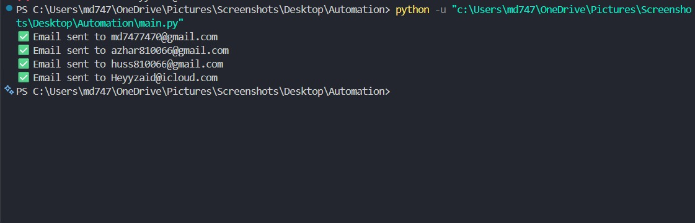
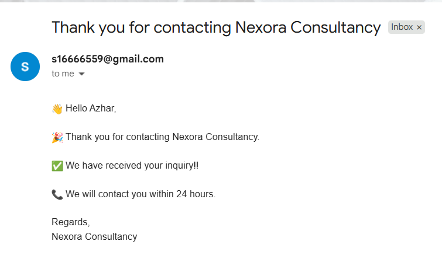

# Bulk Email Sender

## Installation

```bash
pip install -r requirements.txt
```

## Setup

1. Copy `.env.example` to `.env`

2. Edit `.env`

```env
SENDER_EMAIL=your_email@gmail.com
APP_PASSWORD=your_app_password
```

3. Run

```bash
python main.py
```

# 📧 Bulk Email Sender

A Python-based Bulk Email Sender that reads contacts from a CSV file, personalizes email templates, and sends emails securely using Gmail SMTP.

## ✨ Features

- 📄 Read contacts from a CSV file
- 📨 Send personalized emails
- 🔐 Secure Gmail SMTP authentication
- 🔒 Store credentials using `.env`
- 📂 Modular Python architecture
- 📋 Easy-to-edit email templates
- ⚡ Bulk email sending

## 📂 Project Structure

```text
Email_Sender/
│
├── config.py              # Load environment variables
├── csv_reader.py          # Read contacts from CSV
├── email_sender.py        # Gmail SMTP functions
├── message_builder.py     # Personalize templates
├── template_loader.py     # Load template.txt
├── main.py                # Main application
├── Name_Email.csv         # Contact list
├── template.txt           # Email template
├── .env.example           # Environment variable example
├── .gitignore
└── README.md
```
## 🛠 Technologies Used

- Python 3
- Gmail SMTP
- python-dotenv
- CSV Module
- EmailMessage

- ## 📸 Screenshots

### Terminal Output



### Email Received




MIT License

Copyright (c) 2026 MD Azhar Hussain

Permission is hereby granted, free of charge, to any person obtaining a copy
of this software and associated documentation files (the "Software"), to deal
in the Software without restriction, including without limitation the rights
to use, copy, modify, merge, publish, distribute, sublicense, and/or sell
copies of the Software, and to permit persons to whom the Software is
furnished to do so, subject to the following conditions:

The above copyright notice and this permission notice shall be included in all
copies or substantial portions of the Software.

THE SOFTWARE IS PROVIDED "AS IS", WITHOUT WARRANTY OF ANY KIND, EXPRESS OR
IMPLIED, INCLUDING BUT NOT LIMITED TO THE WARRANTIES OF MERCHANTABILITY,
FITNESS FOR A PARTICULAR PURPOSE AND NONINFRINGEMENT. IN NO EVENT SHALL THE
AUTHORS OR COPYRIGHT HOLDERS BE LIABLE FOR ANY CLAIM, DAMAGES OR OTHER
LIABILITY, WHETHER IN AN ACTION OF CONTRACT, TORT OR OTHERWISE, ARISING FROM,
OUT OF OR IN CONNECTION WITH THE SOFTWARE OR THE USE OR OTHER DEALINGS IN THE
SOFTWARE.
